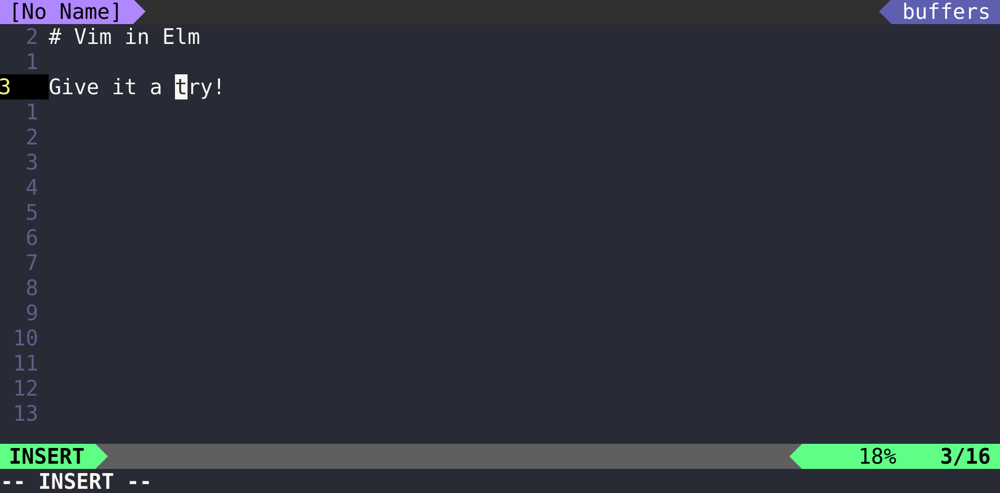

# Vim Emulation

[Vim](https://www.vim.org) implemented in [Elm](https://elm-lang.org).
[Give it a try!](https://andys8.github.io/vim-emulation)

## Features

### Basic Movement

- <kbd>h</kbd> <kbd>l</kbd> <kbd>k</kbd> <kbd>j</kbd> character left, right; line up, down
- <kbd>w</kbd> <kbd>W</kbd> word/WORD right
- <kbd>b</kbd> <kbd>B</kbd> word/WORD left
- <kbd>e</kbd> <kbd>E</kbd> end of word/WORD right
- <kbd>0</kbd> beginning of line
- <kbd>^</kbd> first character of line
- <kbd>$</kbd> last character of line
- <kbd>G</kbd> last line
- <kbd>gg</kbd> first line

### Insertion & replace

- <kbd>i</kbd> <kbd>a</kbd>	insert before, after cursor
- <kbd>I</kbd> <kbd>A</kbd>	insert at beginning, end of line
- <kbd>o</kbd> <kbd>O</kbd>	open a new line below, above the current line
- <kbd><<</kbd> <kbd>>></kbd> shift left, right
- <kbd>S</kbd> <kbd>cc</kbd> change current line
- <kbd>ciw</kbd> change text in word

### Deletion

- <kbd>x</kbd> <kbd>Delete</kbd> delete character under cursor
- <kbd>X</kbd> delete character before cursor
- <kbd>dd</kbd> delete current line
- <kbd>diw</kbd> delete text in word

### Copying

- <kbd>yy</kbd> yank current line
- <kbd>yiw</kbd> yank in word
- <kbd>p</kbd> put register after cursor position
- <kbd>P</kbd> put register before cursor position

### Ex commands

- <kbd>:q!</kbd> quit and discard changes
- <kbd>:[n]</kbd> jump to an absolute line number `[n]`

### Undoing, repeating & registers

- <kbd>.</kbd> repeat last changes (*WIP*)

## Further information

- [Vim documentation: help](http://vimdoc.sourceforge.net/htmldoc)
- [Vim Quick Reference Card](http://users.ece.utexas.edu/~adnan/vimqrc.html)
